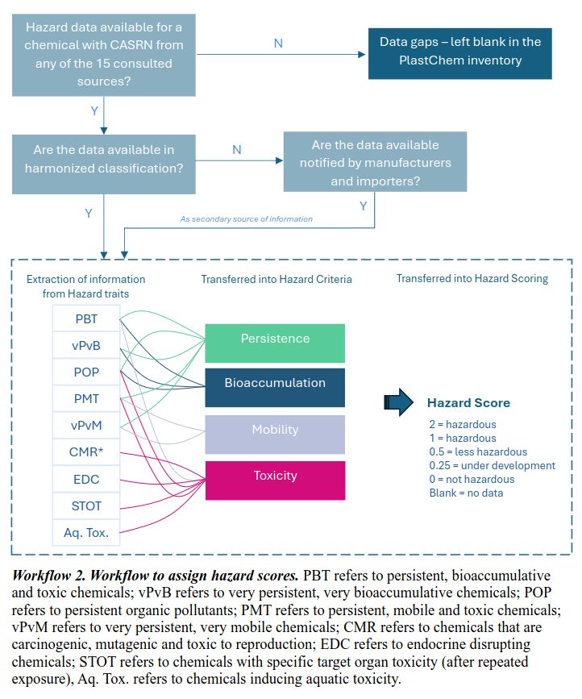

- exclude chemicals without valid CAS RN from further analysis
- group based on structure (is this smart?) → no its not especially since the EYEBALLED it???

- from supplementary info: this is how hazard scores were designed

- pseudolabelling approach → only label those without labels that get high confidence predictions

- 70 15 15 split

- find polyurethane degradation products and predict their toxicity
